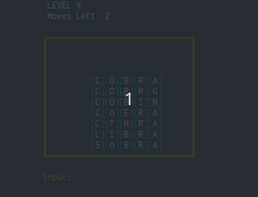

_Terminal user interface word puzzler_
# Letter Shredder


Letter Shredder is a puzzle game, where you seek and destroy words from a grid. The game is a personal project of mine and still very much under developement.

## ⌨️ Game Modes

### 🧩 Puzzle Mode
You have a limited amount of moves to clear the screen.

### 🌧️ Endless Mode
🚧 __Not implemented yet__

## 📥 Installation

### ⚙️ Supported platforms
* Linux

### 📝 Requirements
* `ncurses`
* `make`
* `git`

### ✅ Instructions
```bash
git clone https://github.com/EyzeCOLD/lettershredder.git
cd lettershredder
make
```
### 🏁 Running the game
```bash
# While in the lettershredder directory
./bin/lettershredder
```

## 🚀 The Future
More Puzzle Mode levels and new game modes coming. Later down the line there will be a GUI version with music. Stay tuned!
